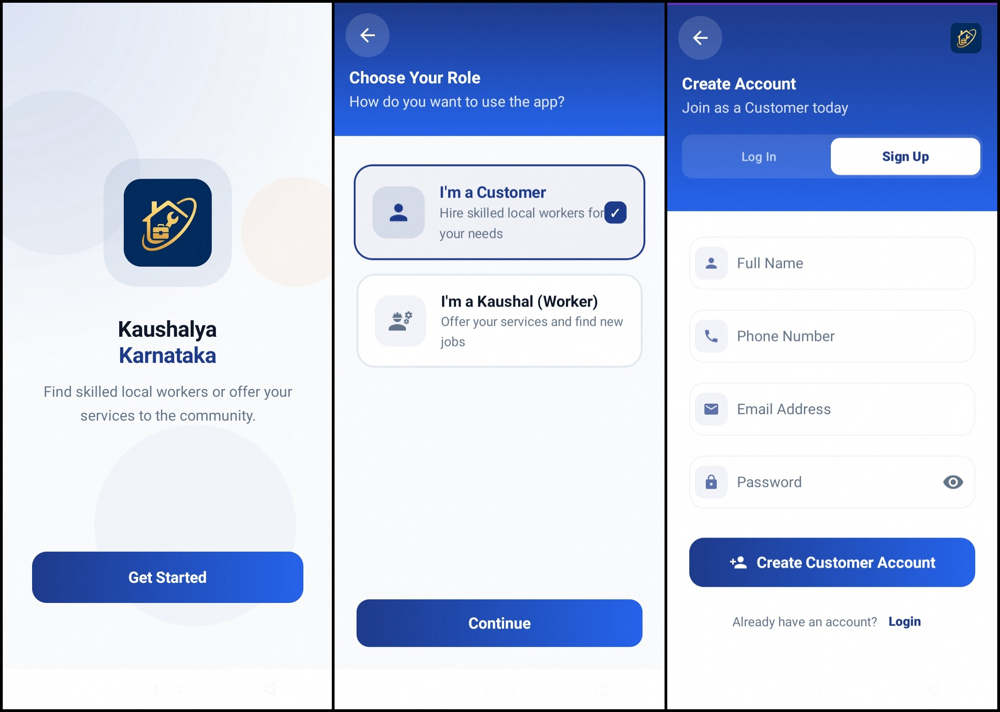
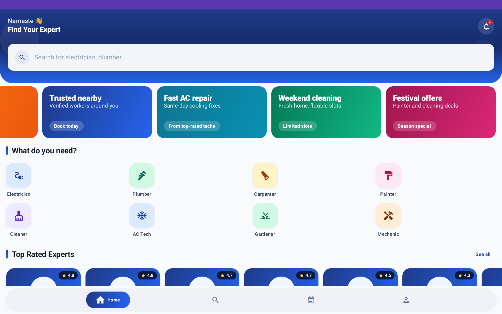

# Kaushalya Karnataka - Service Marketplace App


Kaushalya Karnataka is a modern, high-performance Android application designed to bridge the gap between skilled workers and customers in Karnataka. Built with Jetpack Compose and a robust MVVM architecture, the app provides a seamless experience for hiring experts, managing bookings, and tracking professional portfolios.

## 🚀 Project Overview

The Kaushalya Karnataka platform consists of two primary user flows:
1. **Customers**: Can discover, review, and book services with verified skilled professionals.
2. **Workers**: Can manage their profile, portfolio, track upcoming jobs, and monitor their earnings.

The app uses Firebase for backend authentication and NoSQL data storage (Firestore), while image assets are uploaded and managed via Supabase Storage. The project also integrates an AI review summarizer using OpenRouter.

## ✨ Features

### For Customers
- **Personalized Home Feed**: Discover top-rated experts and trending services in your local area.
- **Advanced Search & Discovery**: Filter workers by category, rating, experience, and service type.
- **Seamless Booking Flow**: Schedule services with integrated date and time slot pickers.
- **Real-time Notifications**: Stay updated on booking status changes and service alerts.
- **Profile & Booking Management**: Track your service history and manage your personal profile.
- **AI-Powered Review Summaries**: Get concise AI-generated summaries of worker reviews.

### For Workers
- **Professional Dashboard**: Monitor job requests, track earnings, and manage upcoming bookings.
- **Service Management**: Easily add, edit, and categorize the services you offer.
- **Dynamic Portfolio**: Showcase your work with a dedicated portfolio gallery.
- **Verification & Certification**: Build trust with verified badges and government certification markers.
- **Availability Toggle**: Control your working status with a simple online/offline switch.

## 📸 App Screenshots

| Onboarding & Registration | Login & Home Explore |
|:---:|:---:|
|  |  |
| **Onboarding & Registration Flow** - Displays the splash screen, role selection (Customer/Worker), and the account creation interface. | **Login & Home Explore** - Shows the customer login screen, search functionality with worker listings, and the main dashboard categories. |

| Worker Search & Profile | Booking & AI Reviews |
|:---:|:---:|
|  |  |
| **Worker Search & Profile** - Illustrates the "Top Rated Experts" discovery and a detailed view of a landscape gardener's profile. | **Booking Management & Reviews** - Showcases the user's upcoming and completed bookings, along with the AI-powered review summary feature. |

| User Profile & Notifications | Worker Management |
|:---:|:---:|
|  |  |
| **User Profile & Notifications** - Displays the customer's personal profile settings and the real-time notification center. | **Worker Service Management** - Shows the interface for workers to manage their services, add new offerings, and update their work portfolio. |

| Worker Booking Workflow | App Banner & Categories |
|:---:|:---:|
|  |  |
| **Booking Workflow (Worker Side)** - Illustrates the worker's perspective for managing active bookings, including sending final amounts and status updates. | **Banner & Category View** - A wide-screen view of the application's homepage with promotional banners and service category icons. |

## 🏗 Architecture Overview

The app follows the **MVVM (Model-View-ViewModel)** architectural pattern, enforcing a strict separation of concerns and a unidirectional data flow.
- **UI Layer**: Built entirely in Jetpack Compose, consuming `StateFlow` from ViewModels.
- **Domain/Business Logic**: Managed in ViewModels.
- **Data Layer**: Repositories abstract the underlying data sources (Firestore, Room, Supabase).
- **Dependency Injection**: Handled centrally via Hilt.

## 🛠 Tech Stack

- **UI Framework**: Jetpack Compose (100% Kotlin)
- **Architecture**: MVVM with Repository pattern
- **Dependency Injection**: Hilt
- **Backend (Auth & DB)**: Firebase Authentication & Cloud Firestore
- **Image Storage**: Supabase Storage
- **Local Persistence**: Room Database
- **Networking**: Ktor Client (for AI summarization features)
- **Navigation**: Compose Navigation with custom slide/fade transitions
- **Asynchronous Logic**: Kotlin Coroutines & Flow
- **Image Loading**: Coil Compose

## 📁 Folder Structure

```text
app/src/main/java/com/kaushalyakarnataka/app/
├── data/           # Data layer: Models, Repositories, Remote and Local Data Sources
├── di/             # Dependency Injection modules (AppModule, SupabaseModule, etc.)
├── navigation/     # App routing and deep linking definitions
├── ui/             # UI layer
│   ├── components/ # Reusable Composables (Custom TopBar, Buttons, Cards)
│   ├── screens/    # Full-screen Composables for different user flows
│   └── theme/      # Material 3 Design System (Color, Typography, Shapes)
├── utils/          # Shared extensions, constants, and helper functions
└── viewmodel/      # Presentation layer: ViewModels managing UI state
```

## 🔐 Security Best Practices

We take security seriously to ensure sensitive keys are never exposed in version control.
- **Never push secrets**: Always add API keys, `google-services.json`, and `.properties` files to `.gitignore`.
- **Use local config files**: The project relies on `Secret/secrets.properties` to load runtime API credentials.
- **Service Accounts**: Only keep service accounts in the `Secret/` folder, which is strictly ignored by Git.
- **Obfuscation**: Use Proguard rules for release builds to obfuscate source code.

## ⚙️ Environment Setup & API Configuration

This project requires environment variables for Firebase, Supabase, and OpenRouter AI. Follow these steps to configure your local setup:

### 1. Configure Secrets
1. Copy the `secrets.example.properties` file to a new file at `Secret/secrets.properties`:
   *(Note: create the `Secret/` folder if it doesn't exist)*
   ```bash
   mkdir Secret
   cp secrets.example.properties Secret/secrets.properties
   ```
2. Open `Secret/secrets.properties` and add your real API keys:
   - `OPENROUTER_API_KEY`: Get this from [OpenRouter](https://openrouter.ai/).
   - `SUPABASE_URL` & `SUPABASE_KEY`: Get these from your [Supabase Project Settings](https://supabase.com/).

### 2. Configure Firebase
1. Create a Firebase project in the [Firebase Console](https://console.firebase.google.com/).
2. Enable **Authentication** (Email/Password) and **Cloud Firestore**.
3. Download the `google-services.json` file for your Android app.
4. Place the file inside the `Secret/` directory (`Secret/google-services.json`).
   *The Gradle build script will automatically copy it to the `app/` folder during compilation. Ensure `app/google-services.json` remains ignored in git.*

### 3. Configure Supabase Storage
1. Create a [Supabase](https://supabase.com/) project.
2. Go to **Storage** and create a new public bucket (e.g., `portfolio-images`).
3. Add the Supabase URL and Anon Key to your `Secret/secrets.properties` file as shown in Step 1.

## 🚀 Installation & Development Workflow

1. **Clone the repository**:
   ```bash
   git clone https://github.com/Suprit-U/Kaushalya-Karnataka.git
   cd Kaushalya-Karnataka
   ```
2. **Set up configurations**: Ensure `Secret/secrets.properties` and `Secret/google-services.json` are present.
3. **Open in Android Studio**: Use Android Studio Ladybug or later.
4. **Build the Project**:
   - Sync the Gradle project.
   - The `BuildConfig` fields will automatically be generated with your API keys.
5. **Run the App**:
   - Run the `app` configuration on an emulator or physical device.

## 🏗 Build and Deployment

To generate a production release build:
1. Ensure your `keystore` is properly configured in `app/build.gradle.kts`.
2. Run the Gradle signing task:
   ```bash
   ./gradlew assembleRelease
   ```
3. The APK/AAB will be generated in `app/build/outputs/`.
4. Ensure you run `firebase deploy --only firestore:indexes` if you added new composite indexes.

## 🛠 Troubleshooting

- **Build Failure: Missing Google Services**
  - *Fix*: Ensure `google-services.json` is located at `Secret/google-services.json` or directly in `app/google-services.json`.
- **Supabase/OpenRouter APIs failing**
  - *Fix*: Ensure your `Secret/secrets.properties` is properly formatted with no trailing spaces and you have rebuilt the app to update `BuildConfig`.
- **Firestore Missing Index Errors**
  - *Fix*: The app is configured with single-field equality filters to avoid missing index errors. However, if you see an error in Logcat with a direct URL to create the index, simply click the URL and wait for it to build.

## 🤝 Contribution Guidelines

This project follows modern clean code principles. For adding new features:
1. Fork the repository and create a feature branch (`feature/your-feature-name`).
2. Follow the MVVM structure and ensure dependency injection is used for all services.
3. Keep the UI layer reactive using `StateFlow`.
4. Do not hardcode any sensitive credentials. Use `BuildConfig` mapped from `Secret/secrets.properties`.
5. Run `./gradlew build` and test your changes before committing.
6. Open a Pull Request with a detailed description of your changes.

---

*Built with ❤️ for a Skilled Karnataka.*
